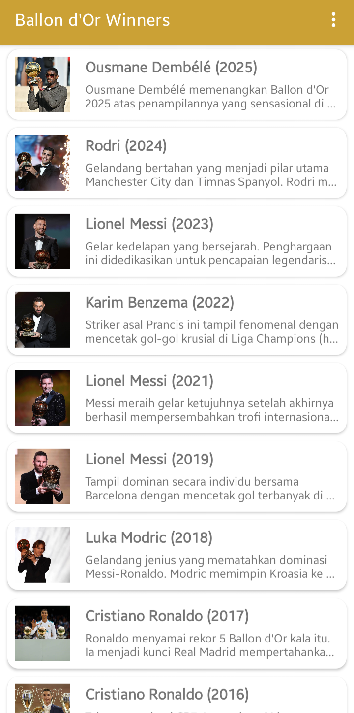
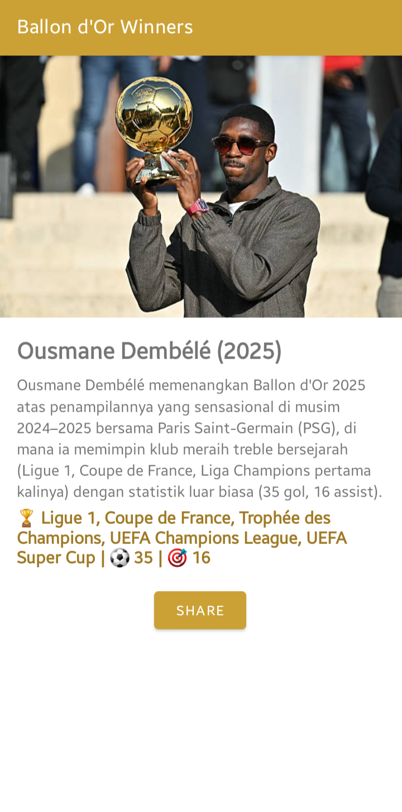
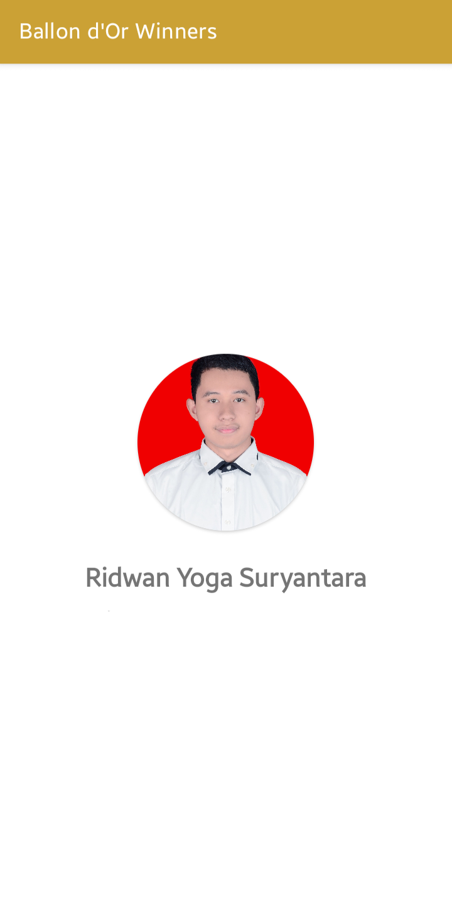

<div align="center">

  
  
  
  [](https://opensource.org/licenses/MIT)

</div>

<br />

# 🏆 Ballon d'Or App

A native Android application designed to showcase the history of **Ballon d'Or** winners. This project was developed as a final submission for the **IDCamp 2025: AI Android Developer** learning path (Beginner Level).

Built with ❤️ using **Kotlin** and **XML**.

## 📱 About The Project

This application provides a user-friendly interface to browse the prestigious Ballon d'Or award winners. Users can view a comprehensive list of winners from various years, complete with their photographs and brief descriptions.

This project demonstrates core Android development concepts, including:
* **RecyclerView**: For efficient and dynamic list rendering.
* **Intent Navigation**: For moving between the list and detail views.
* **Clean UI/UX**: Utilizing Android's XML layout system for a responsive design.
* **Data Handling**: Managing local data resources (Arrays/Strings).

## 🛠️ Tech Stack

* **Language**: Kotlin
* **UI Framework**: Android XML Layouts
* **IDE**: Android Studio
* **Build System**: Gradle Kotlin DSL (`build.gradle.kts`)
* **Version Control**: Git & GitHub

## 🚀 Features

* **Winner Gallery**: A scrollable list of Ballon d'Or winners (e.g., 2025, 2024, etc.) utilizing `RecyclerView`.
* **Detail View**: A dedicated page displaying detailed information, photo, and description for each selected player.
* **Profile Page**: A simple "About" page displaying the developer's profile.
* **Responsive Design**: Optimized for various screen sizes (Mobile/Portrait).

## 📸 Screenshots

|   List Page   |   Detail Page   |   About Page   |
| :-----------: | :-------------: | :------------: |
|  |  |  |

## 💻 How to Run

1.  **Clone** this repository to your local machine:
    ```bash
    git clone https://github.com/Yogs4R/ballon-dor-app.git
    ```
2.  Open **Android Studio**.
3.  Select **Open an Existing Project** and navigate to the cloned directory.
4.  Wait for the **Gradle Sync** process to finish.
5.  Connect your Android device (USB Debugging enabled) or use an Emulator.
6.  Click the **Run (▶)** button.

## 👨‍💻 Author

**Yogs4R**
* Information Systems Student
* IDCamp 2025 AI Android Developer Participant

---
*Created for educational purposes and submission requirements.*
